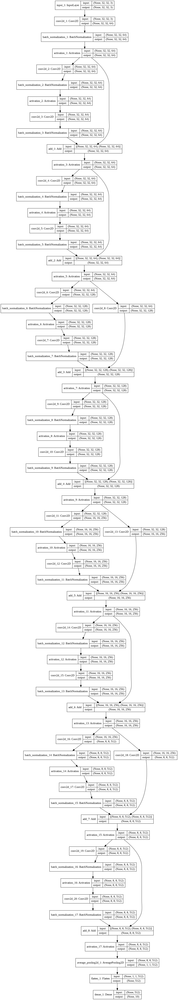
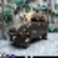
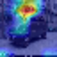
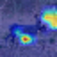
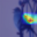
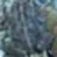
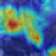
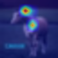
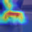

## Assignment 4B

As part of this assignment, I have implemented the `ResNet18` model and trained on `cifar-10` dataset. And I was able to reach the maximum test accuracy of `0.90510` in `36` epochs.

Model Acrhitecture:

---

Notebooks:

[Training Notebook](./ResNet18_train.ipynb)

[GradCAM Notebook](./ResNet18_GradCAM.ipynb) 

---

GradCAM Results:

Original            |  GradCAM 
:-------------------------:|:-------------------------:
  |  
  |  
  |  
  |  
  |  
  |  
  |  
  |  
  |  
  |  